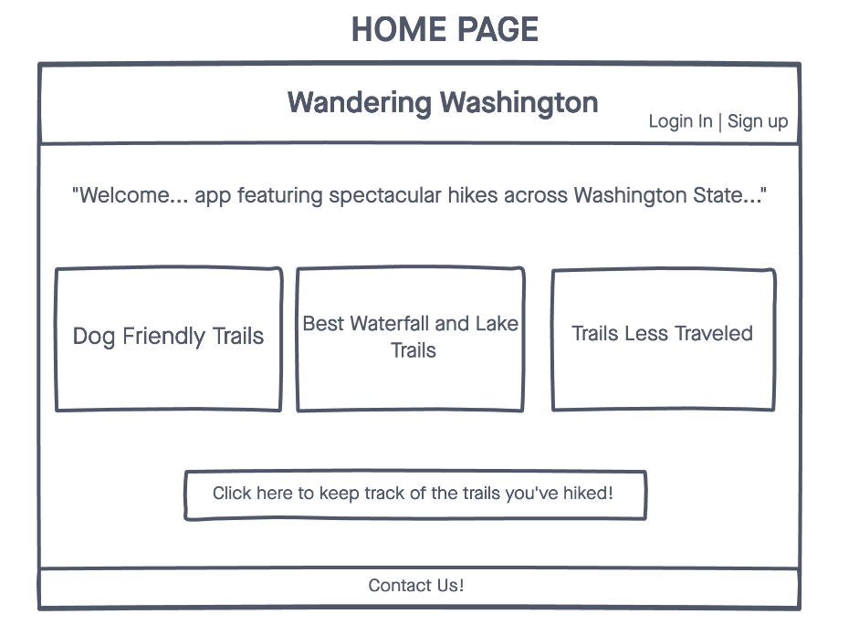
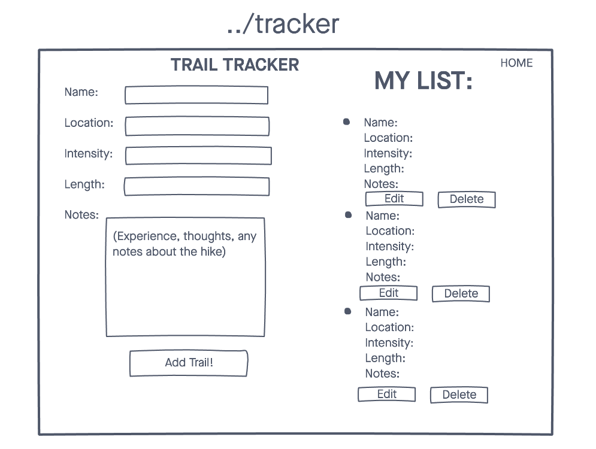
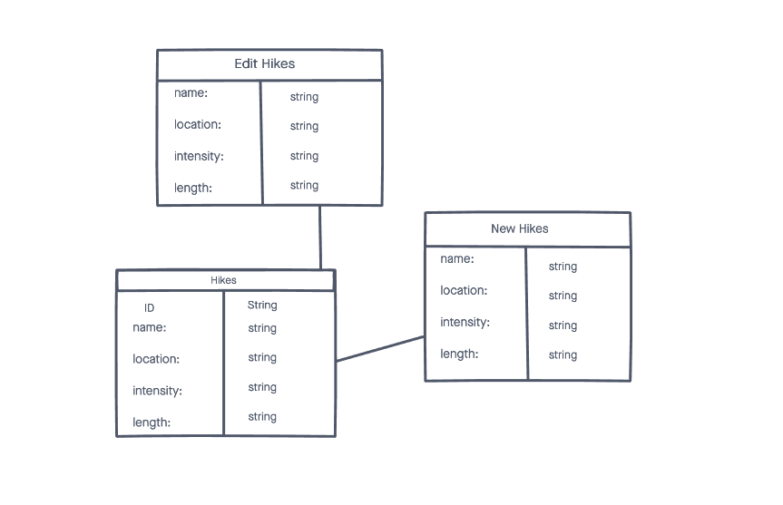
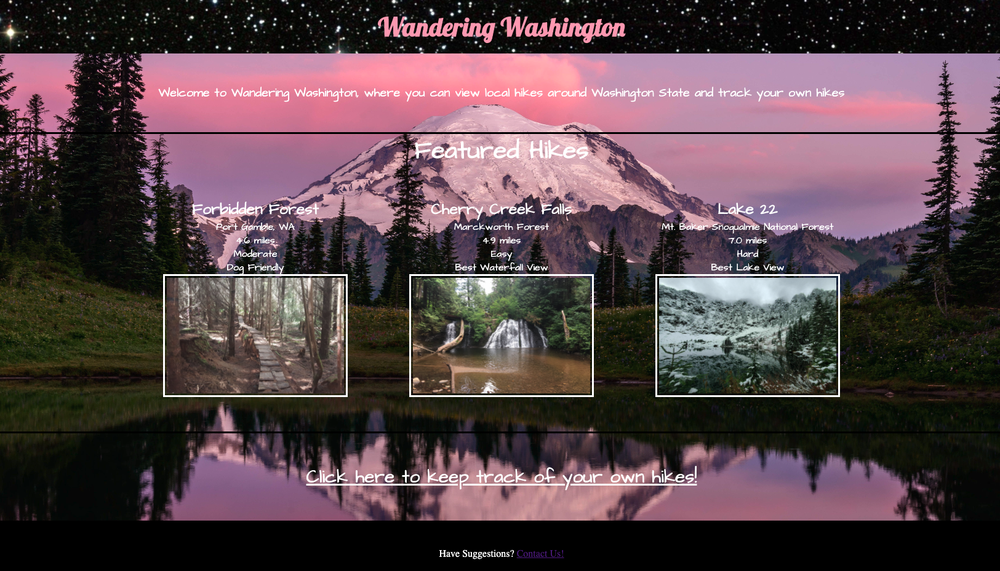
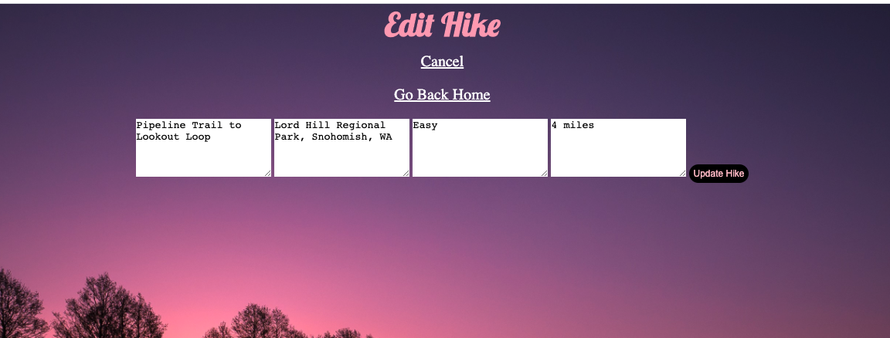

# Wandering Washington
A web application helping people find hikes suited for them as well as helping create your own list of hikes to keep track of.

## Technologies Used
- HTML5
- CSS3
- JavaScript
- Express
- Mongoose
- Morgan
- Google Fonts
- MongoDB

## Wireframes

## ERD

## Screenshots

## Getting Started
[Click Here](https://wandering-washington.herokuapp.com/) to see the deplyed app!

## Obstacles
- Deploying application on Heroku
- Sending messages to mongoDB

## Future Enhancements
- create a log in for users
- have users leave reviews on the featured hikes