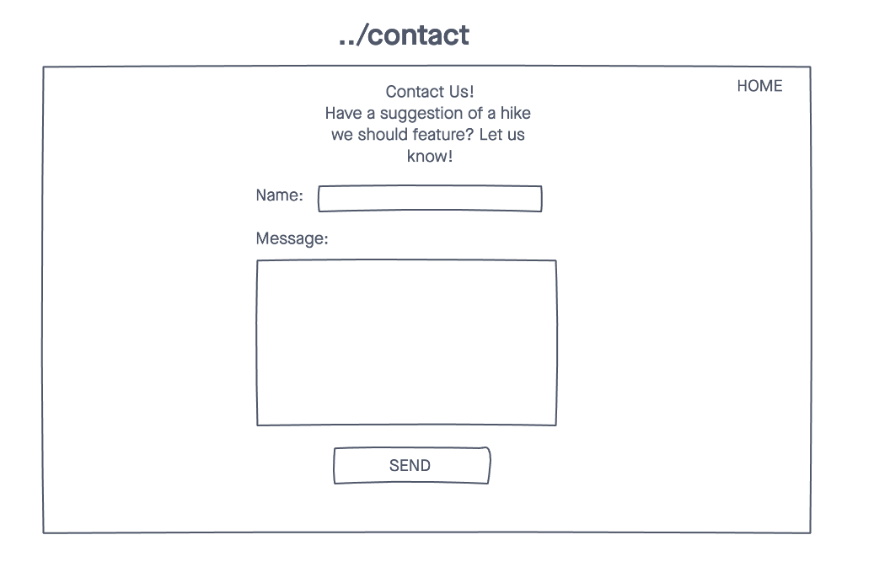

# Wandering Washington
A web application helping people find hikes suited for them as well as helping create your own list of hikes to keep track of.

## Technologies Used
- HTML5
- CSS3
- JavaScript
- Express
- Mongoose
- Morgan
- Google Fonts
- MongoDB
- Node.js

## Wireframes

## ERD

## Screenshots

## Getting Started
[Click Here](#) to see the deplyed app!

## Obstacles

## Future Enhancements